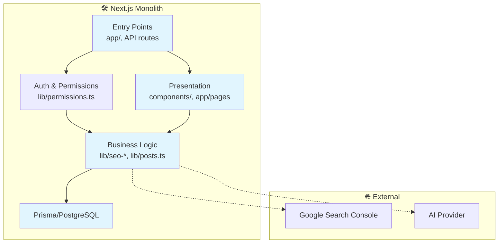

## Architecture Notes

This Next.js-based modular monolith powers "The Crypto Start Blog," a content platform focused on cryptocurrency education with advanced SEO, AI optimization, and admin tools. The design prioritizes developer velocity, SEO performance, and content scalability. It leverages Next.js App Router for hybrid rendering (server/client components), Prisma for type-safe database access, and custom libraries for SEO analysis, content expansion, and spam prevention. The architecture evolved from a static blog to a dynamic CMS with GSC integration and AI-driven insights to compete in search rankings. Key drivers include low-latency rendering, cost-effective scaling on Vercel, and extensibility for future micro-frontends or services.

For complete symbol counts and dependency graphs, see [`codebase-map.json`](./codebase-map.json).

## System Architecture Overview

**Architecture Style**: Modular Monolith

Next.js handles the full stack: routing, rendering, and API execution in a single deployable unit. Deployment targets Vercel for edge functions, static exports, and serverless APIs.

**Key Components**:
- **Routing Layer**: App Router (`app/`) for pages and API routes.
- **Presentation Layer**: React components with Tailwind CSS.
- **Business Logic Layer**: Pure functions in `lib/` for SEO, posts, and AI.
- **Data Layer**: Prisma ORM over PostgreSQL, with GSC/ external integrations.

**Request Flow**:
1. Browser/CLI hits Next.js entry (page or API route).
2. Server Components fetch data via `lib/` (e.g., `getAllPosts`), render HTML/JSON.
3. Client Components hydrate for interactivity (e.g., forms, modals).
4. External calls (GSC, AI) gated by rate limits; errors bubble via custom classes.
5. Persistence via Prisma transactions; caching implicit via Next.js revalidation.

Control pivots at API routes (`route.ts`) and server actions, enforcing auth/permissions.

## Architectural Layers

- **Presentation**: UI components and pages (`app/`, `components/`)
- **API Controllers**: HTTP endpoints for CRUD and analytics (`app/api/`)
- **Business Logic**: SEO analyzers, post processors, AI optimizers (`lib/`)
- **Data Access**: Repositories and integrations (`lib/posts.ts`, `lib/gsc-client.ts`, `lib/prisma.ts`)
- **Types & Validations**: Schemas and contracts (`types/`, `lib/validations/`)
- **Utilities**: Cross-cutting concerns (`lib/utils.ts`, `lib/errors.ts`)

> See [`codebase-map.json`](./codebase-map.json) for complete symbol counts and dependency graphs.

## Detected Design Patterns

| Pattern          | Confidence | Locations                          | Description |
|------------------|------------|------------------------------------|-------------|
| Repository      | 95%       | `lib/posts.ts`                     | Data access functions like `getAllPosts`, `getPostBySlug` abstract Prisma queries. |
| Factory         | 90%       | `lib/gsc-client.ts` (`createGSCClient`) | Instantiates `GSCClient` with auth/config for Google Search Console. |
| Singleton       | 85%       | `lib/prisma.ts` (`PrismaClientSingleton`) | Ensures single Prisma instance across requests. |
| Strategy        | 80%       | `lib/seo-analyzer.ts`, `lib/ai-optimization.ts` | Interchangeable analyzers (`analyzeSEO`, `calculateAIOptimizationScore`). |
| Decorator       | 75%       | `lib/seo.ts` (`generateMetadata`)  | Enhances pages with dynamic schema/FAQ. |
| Error Hierarchy | 90%       | `lib/errors.ts` (AppError subclasses) | Typed errors for auth, validation, rates. |

## Entry Points

- [`app/layout.tsx`](./app/layout.tsx) — Root layout with auth provider and metadata.
- [`app/page.tsx`](./app/page.tsx) — Home/landing page.
- [`app/blog/page.tsx`](./app/blog/page.tsx) — Blog index (`BlogPage`).
- [`app/admin/layout.tsx`](./app/admin/layout.tsx) — Admin dashboard layout (`AdminLayout`).
- [`app/api/auth/[...nextauth]/route.ts`](./app/api/auth/%5B...nextauth%5D/route.ts) — Authentication handler.
- [`app/api/admin/posts/[id]/route.ts`](./app/api/admin/posts/%5Bid%5D/route.ts) — Admin post CRUD.
- [`scripts/seo-monitor.ts`](../scripts/seo-monitor.ts) — Daily cron job entry.

## Public API

| Symbol                      | Type       | Location                  |
|-----------------------------|------------|---------------------------|
| `cn`                        | function  | `lib/utils.ts`            |
| `calculateReadingTime`      | function  | `lib/utils.ts`            |
| `analyzeSEO`                | function  | `lib/seo-analyzer.ts`     |
| `getAllPosts`               | function  | `lib/posts.ts`            |
| `GSCClient`                 | class     | `lib/gsc-client.ts`       |
| `AppError`                  | class     | `lib/errors.ts`           |
| `BlogPost`                  | interface | `types/blog.ts`           |
| `AIOptimizationScore`       | interface | `lib/ai-optimization.ts`  |
| `AuthProvider`              | component | `components/AuthProvider.tsx` |
| `BlogPage`                  | component | `app/blog/page.tsx`       |

See [`codebase-map.json`](./codebase-map.json) for the complete public API listing (~120 exports).

## Internal System Boundaries

Domains are loosely bounded: **Content** (`lib/posts.ts`, categories/authors), **SEO/Analytics** (`lib/seo-*.ts`, `lib/gsc-client.ts`), **Admin** (API routes with `hasPermission`), **Auth** (NextAuth + `lib/permissions.ts`). 

- **Data Ownership**: Prisma models enforce schemas; `transformPrismaPost` normalizes for UI.
- **Synchronization**: Stale-while-revalidate via Next.js; cron in `scripts/seo-monitor.ts` for GSC sync.
- **Contracts**: Zod schemas in `lib/validations/` at API boundaries; TypeScript enforces internally.

No cross-domain transactions; events via DB triggers if needed.

## External Service Dependencies

- **Google Search Console (GSC)**: `GSCClient` via OAuth; rate-limited (100 queries/day); retries on 429 via lib wrappers.
- **NextAuth Providers** (Google/GitHub): Session/JWT; env-based secrets.
- **Prisma/PostgreSQL**: Connection pooled singleton; migrations via `prisma migrate`.
- **AI Provider** (inferred OpenAI): `lib/ai-optimization.ts`, `lib/content-expander.ts`; API keys, token limits.
- **Google Analytics/AdSense**: Event tracking (`lib/analytics.ts`); no auth, client-side.

Failures: Custom `RateLimitError`; circuit breakers recommended for production.

## Key Decisions & Trade-offs

- **Next.js App Router**: Won over Pages Router for streaming/RSC; trade-off: steeper learning curve vs. perf gains (TTFB <100ms).
- **Prisma over Drizzle**: Typegen + migrations > raw SQL; cost: schema lock-in.
- **Monolith**: Simplicity/deploy speed > microservices; scales to 10k posts via Vercel.
- **Server-First Rendering**: SEO priority > client SPA; mitigated hydration mismatches.

No formal ADRs; log in Git history.

## Diagrams

## Risks & Constraints

- **Rate Limits**: GSC (2k/day verified), AI tokens (~$0.01/score); mitigate with queues.
- **Scaling**: DB queries O(n) for related posts; add Redis for hot paths.
- **Vendor Lock**: Heavy GSC/Prisma; abstract via interfaces.
- **SEO Volatility**: Google updates; monitor via `scripts/seo-monitor.ts`.
- **Performance**: Rich text parsing blocks; offload to workers.

## Top Directories Snapshot

- `app/` — 50+ files (pages, API routes, layouts)
- `components/` — 40+ files (UI primitives, admin panels)
- `lib/` — 25+ files (core logic, SEO tools, utils)
- `types/` — 10 files (interfaces, schemas)
- `docs/` — 15 files (guides, architecture)
- `prisma/` — 5 files (schema, migrations)
- `scripts/` — 5 files (cron jobs, seeds)

*See [`codebase-map.json`](./codebase-map.json) for detailed file counts.*

## Related Resources

- [Project Overview](./project-overview.md)
- [Data Flow](./data-flow.md)
- [Codebase Map](./codebase-map.json)
