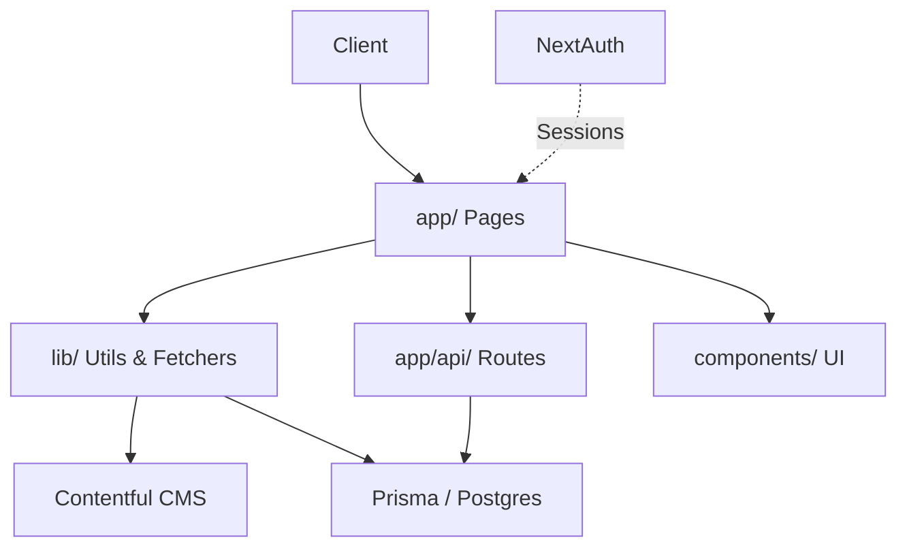

## Architecture Notes

This system is a monolithic Next.js application (version 14+) utilizing the App Router for a crypto-focused blog platform. It integrates Contentful as a headless CMS for dynamic blog content, Prisma for user authentication and management with a PostgreSQL backend, and NextAuth.js for session handling. The design prioritizes static site generation (SSG) for blog posts to optimize performance and SEO, while server-side rendering (SSR) and API routes handle dynamic admin features and user interactions. The current architecture evolved from a static blog to include user auth and admin panels to support community growth, balancing developer velocity with scalability. Content is decoupled via Contentful to enable non-technical content updates, with TypeScript enforcing contracts across layers.

## System Architecture Overview

The application is a **monolithic Next.js deployment**, typically hosted on Vercel for edge caching and global CDN distribution. It follows a layered topology:

- **Client requests** enter via pages in `app/` (e.g., `/blog/[slug]`), triggering SSG/SSR.
- Control pivots to `lib/` for data fetching (Contentful queries) and utils (SEO, permissions).
- API routes in `app/api/` handle mutations (e.g., user registration).
- Persistence flows through Prisma to a Postgres DB.
- External pivots to Contentful for reads and NextAuth providers for login.

No microservices; all concerns are co-located for simplicity. Deployment uses `next build && next start`, with Docker support for local dev.

## Architectural Layers

- **Presentation Layer**: UI rendering and components (`app/`, `components/`)
- **API Layer**: Route handlers for auth and admin (`app/api/`)
- **Business Logic Layer**: Data fetching, utils, and domain functions (`lib/`, `types/`)
- **Persistence Layer**: ORM and schema (`prisma/`)
- **Infrastructure Layer**: Config, constants, and integrations (`lib/contentful.ts`, `lib/prisma.ts`)

> See [`codebase-map.json`](./codebase-map.json) for complete symbol counts and dependency graphs.

## Detected Design Patterns

| Pattern       | Confidence | Locations                          | Description |
|---------------|------------|------------------------------------|-------------|
| Singleton    | 95%       | `lib/prisma.ts` (PrismaClientSingleton) | Ensures single Prisma instance across requests |
| Factory      | 85%       | `lib/contentful.ts` (getClient)    | Lazy-creates Contentful client with env config |
| Adapter      | 80%       | `lib/contentful.ts` (transformPost)| Maps Contentful entries to internal BlogPost types |
| Decorator    | 75%       | `lib/seo.ts` (generateMetadata)   | Wraps page metadata with structured schemas |
| Strategy     | 70%       | `lib/permissions.ts` (hasRole/hasPermission) | Role-based access via configurable mappings |

## Entry Points

- [`app/layout.tsx`](../app/layout.tsx) — Root layout with AuthProvider and metadata
- [`app/page.tsx`](../app/page.tsx) — Homepage (likely redirects or landing)
- [`app/blog/page.tsx`](../app/blog/page.tsx) — Blog index with pagination/search
- [`app/blog/[slug]/page.tsx`](../app/blog/[slug]/page.tsx) — Individual post with SSG
- [`app/admin/page.tsx`](../app/admin/page.tsx) — Admin dashboard
- [`app/api/auth/register/route.ts`](../app/api/auth/register/route.ts) — User registration API
- [`app/api/users/route.ts`](../app/api/users/route.ts) — User listing API
- [`prisma/seed.ts`](../prisma/seed.ts) — Database seeding script

## Public API

| Symbol                  | Type      | Location                  |
|-------------------------|-----------|---------------------------|
| `AboutPage`             | function | `app/about/page.tsx`     |
| `AdminDashboard`        | function | `app/admin/page.tsx`     |
| `AppError`              | class    | `lib/errors.ts`          |
| `AuthenticationError`   | class    | `lib/errors.ts`          |
| `AuthorizationError`    | class    | `lib/errors.ts`          |
| `AuthProvider`          | function | `components/AuthProvider.tsx` |
| `BlogCategory`          | type     | `types/blog.ts`          |
| `BlogMetadata`          | interface| `types/blog.ts`          |
| `BlogPost`              | interface| `types/blog.ts`          |
| `calculateReadingTime`  | function | `lib/utils.ts`           |
| `checkRateLimit`        | function | `lib/rate-limit.ts`      |
| `ContentfulBlogPost`    | interface| `types/blog.ts`          |
| `Footer`                | function | `components/Footer.tsx`  |
| `generateMetadata`      | function | `lib/seo.ts`             |
| `getAllPosts`           | function | `lib/contentful.ts`      |
| `getPostBySlug`         | function | `lib/contentful.ts`      |
| `hasPermission`         | function | `lib/permissions.ts`     |
| `RolePermissions`       | type     | `types/roles.ts`         |
| `SignOutButton`         | function | `components/SignOutButton.tsx` |

## Internal System Boundaries

Domains are separated by bounded contexts:
- **Blog Domain** (`lib/contentful.ts`, `types/blog.ts`): Owns Contentful data; synchronous queries via factory client. No direct DB access.
- **Auth Domain** (`app/api/auth/`, `lib/permissions.ts`): Owns user data via Prisma; RBAC enforced by `hasRole/hasPermission`. Sessions via NextAuth.
- **Admin Domain** (`app/admin/`): Reads from auth DB, lists via `fetchUsers`; permissions gate UI.

Contracts enforced via exported types (e.g., `BlogPost`, `UserWithRoles`). No shared mutable state; data sync via API fetches.

## External Service Dependencies

- **Contentful**: Headless CMS for blog posts/categories. API key auth via env vars; rate-limited (query costs tracked via `getTotalPostsCount`). Fallback: Cache SSG outputs.
- **Prisma/PostgreSQL**: User persistence. Connection pooled singleton; failures retried via Prisma middleware.
- **NextAuth.js Providers** (e.g., Credentials): Implicit via `[...nextauth]`. Rate-limited logins.
- **Google AdSense**: Client-side ads (`components/AdSense.tsx`). No auth; CSP compliant.

## Key Decisions & Trade-offs

- **Contentful over self-hosted CMS**: Decouples content team; traded query latency (200-500ms) for zero-downtime updates. Alternative: Direct Markdown files (rejected for dynamic search/pagination).
- **SSG for posts**: SEO/performance win; static params via `generateStaticParams`. Dynamic admin SSR for freshness.
- **Prisma + NextAuth**: Rapid auth setup; traded schema flexibility for type-safety. Experimented with Drizzle (slower migration).
- **Monolith**: Simplicity over microservices; scales to 10k users via Vercel.

## Diagrams

## Risks & Constraints

- **Contentful Vendor Lock**: Migration path via export APIs; assume 1M entries max.
- **Cold Starts**: Serverless functions (API routes) latency <1s target; mitigated by edge runtime.
- **Rate Limits**: Enforced via `checkRateLimit`; DB-backed Upstash if scaled.
- **SEO Dependency**: Structured data via `lib/seo.ts`; Core Web Vitals monitored.

## Top Directories Snapshot

- `app/` (~25 files) — Next.js App Router pages, layouts, and API routes
- `components/` (~15 files) — Reusable React components (e.g., TableOfContents, BlogPost)
- `lib/` (~20 files) — Core utilities, data access (contentful.ts, seo.ts, prisma.ts)
- `types/` (~5 files) — TypeScript definitions for blog, auth, roles
- `prisma/` (~5 files) — Database schema, migrations, seed
- `docs/` (~10 files) — Documentation and guides
- `public/` (~5 files) — Static assets (images, favicon)

## Related Resources

- [project-overview.md](./project-overview.md)
- [data-flow.md](./data-flow.md)
- [`codebase-map.json`](./codebase-map.json)
